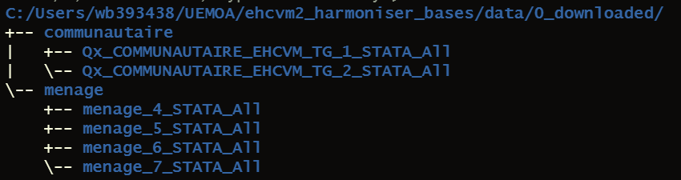

# Objectif

Transformer les fichiers exportés par Survey Solutions dans un format qui ressemble plus à la structure du questionnaire papier.

En particulier :

- Créer un fichier par section du questionnaire
- Créer un fichier par roster
- Créer des identifiants de roster du nom dicté part le questionnaire papier
- Ramener toutes les variables vers le cas minuscule
- Supprimer les variables non-nécessaires

# Installation

## Télécharger ce répositoire

- Cliquer sur le bouton `Clone or download`
- Cliquer sur l'option `Download ZIP`
- Télécharger dans le dossier sur votre machine où vous voulez héberger ce projet

## Paramétrage

Avant d'utilier le programme pour la première fois, il faut faire deux types de réglages: 

1. Données
1. Paramètres

### Données

Les étapes sont:

- Télécharger les données dans `/0_downloaded/`
- Décomprimer chaque fichier zip dans son propre sous-répertoire

Les données doivent être rangées dans une architecture comme suit:



Autrement dit:

- Dans `/0_downloaded/`, chaque type de données a son propre sous-répertoire:
    - `menage`
    - `communautaire`
- Dans chaque sous-répertoire de type (i.e., `menage`, `communautaire`), chaque version des données a également son propre sous-répertoire

### Paramètres

Modifier les paramètres des fichiers suivants:

- `harmoniser_bases_menage.do`
- `harmoniser_bases_communautaire.do`

Pour chaque fichier, les paramètres à renseigner sont comme suit:

```
/*-----------------------------------------------------------------------------
Paramètres du programme
-----------------------------------------------------------------------------*/

local proj_dir 	""
local fichier_principal "menage.dta"
local case_ids_vars "grappe id_menage vague"
local pays ""
local annee "2021"

```

En plus de détail:

- `proj_dir`. Le répertoire dans lequel se trouve ce projet. Autrement dit, la racine du projet.
- `fichier_principal`. Le nom, avec extension `.dta`, du fichier principal. De règle général, ceci doit être `"menage.dta"`. Mais le nom peut être différent.
- `case_ids_vars`. Les variables, en dehors de `interview__id` et `interview__key`, qui identifient les observations. De règle général, il s'agit de l'identifiant grappe (`grappe`), de l'identifiant ménage (`id_menage`), et de la vague de collecte (`vague`). On peut élargir la liste pour inclure les identifiations géographiques. Ces variables doivent provenir du fichier `fichier_principal`.
- `pays`. L'identifiant de 3 lettres du pays. Ces caractères seront inclus dans le nom de chaque fichier de sortie.
- `annee`. L'année de collecte.

# Emploi

Pour chaque programme:

- Lancer le programme
- Retrouver les résultats dans `/data/3_output/`
